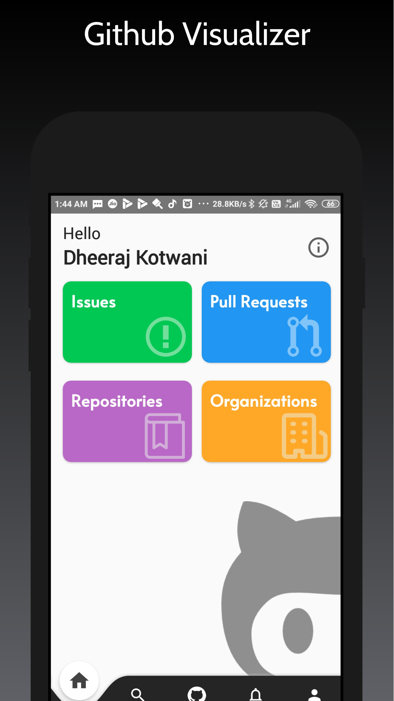
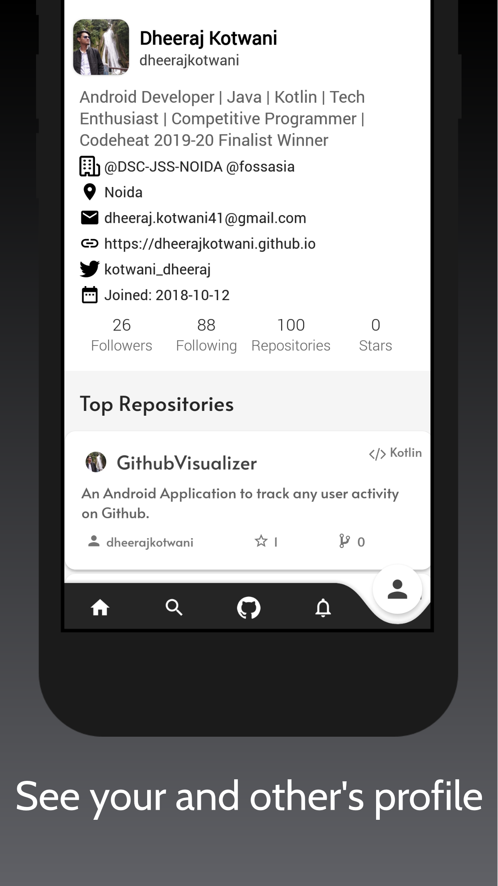
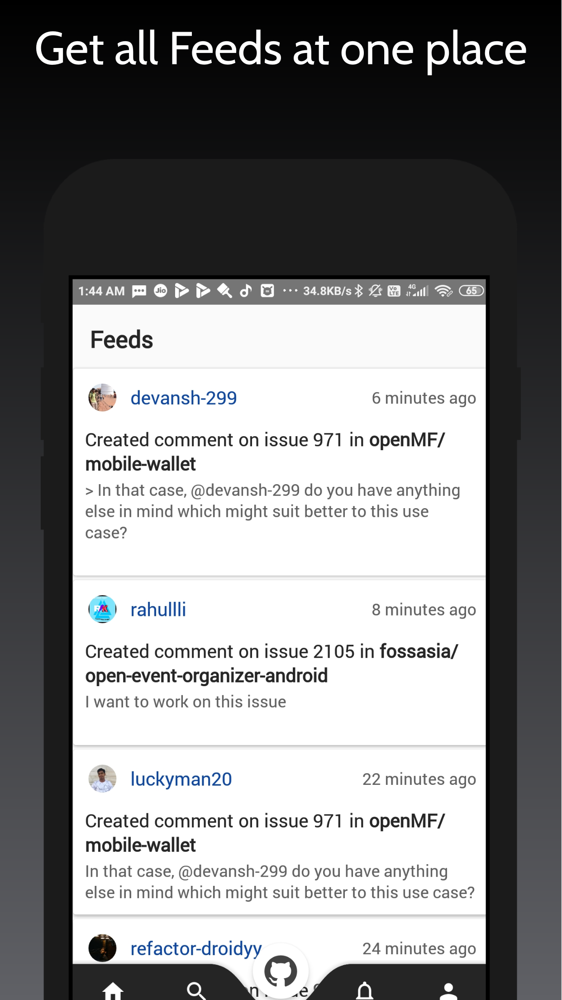
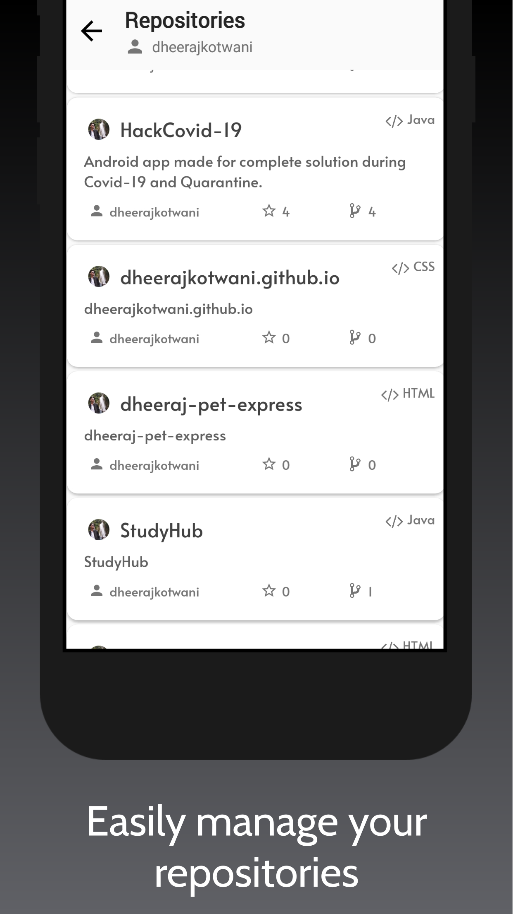
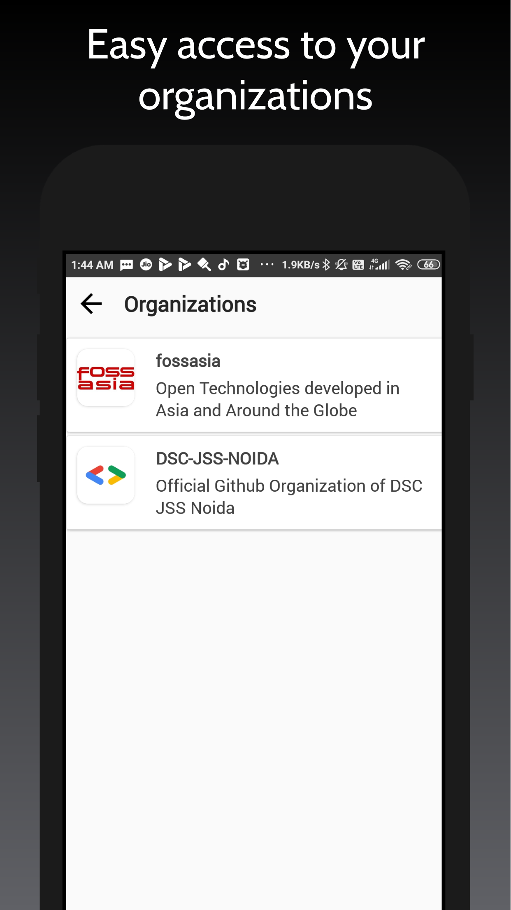
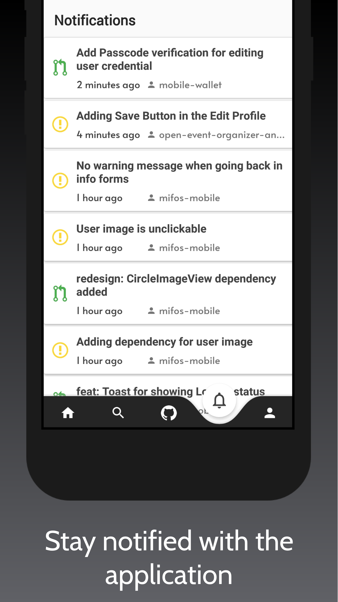

# Github Visualizer
### 📲 Android Application to track any user activity on Github built using the Github Developers Api.

- Explore all Feeds at one place.
- Get list for latest notification.
- Get details of all the issues and pull request.
- Easy access to all your repositories.
- Search for users in one go.
- Follow or unfollow any user.
- Get list of all the Starred repositories of you as well as any other user.

## Tech used
- Github Api
- Kotlin
- Model-View-Viewmodel Architecture
- Navigation component
- Room database
- Retrofit 2
- GSON
- Glide
- Firebase Analytics
- Firebase Auth

## Screenshots
&nbsp;&nbsp;
&nbsp;&nbsp;
&nbsp;&nbsp;

## Requirements
- Android 5.0 and Above
- Min sdk version 21

## Permissions
- Internet

## License

This project is currently licensed under the MIT License A copy of [LICENSE](LICENSE.txt) should be present along with the source code.

