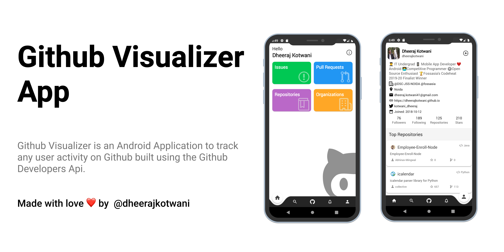

# Github Visualizer
### 📲 Android Application to track any user activity on Github built using the Github Developers Api. A sample application to demonstrate how to use Jetpack Architecture Components in an Android Application following the Clean MVVM Architecture concepts. 

[](https://github.com/dheerajkotwani/GithubVisualizer/blob/master/LICENSE.txt)


<a href='https://play.google.com/store/apps/details?id=project.dheeraj.githubvisualizer'></a>

## 🚀 Features
- Explore all Feeds at one place.
- Get list for latest notification.
- Get details of all the issues and pull request.
- Easy access to all your repositories.
- Search for users in one go.
- Follow or unfollow any user.
- Get list of all the Starred repositories of you as well as any other user.
- Get all data of any user
- Mutliple methods to share data from users and repositories.
- Clean MVVM Architecture.

## ⚙ Tech used
- Github Api
- Kotlin
- Model-View-Viewmodel Architecture
- Navigation component
- Room database
- Retrofit 2
- GSON
- Glide
- Firebase Analytics
- Firebase Auth

## 📷 Screenshots
&nbsp;&nbsp;
&nbsp;&nbsp;
&nbsp;&nbsp;

## 🎯 Requirements
- Android 5.0 and Above
- Min sdk version 21

## 💻 Permissions
- Internet

## 💲 Donate
##### If you like the project and wanna support me develop new stuff, You can buy me a coffee.
<a href="https://www.buymeacoffee.com/dheerajkotwani" target="_blank"></a>


## 📝 License

```
MIT License

Copyright (c) 2020 Dheeraj Kotwani

Permission is hereby granted, free of charge, to any person obtaining a copy
of this software and associated documentation files (the "Software"), to deal
in the Software without restriction, including without limitation the rights
to use, copy, modify, merge, publish, distribute, sublicense, and/or sell
copies of the Software, and to permit persons to whom the Software is
furnished to do so, subject to the following conditions:

The above copyright notice and this permission notice shall be included in all
copies or substantial portions of the Software.

THE SOFTWARE IS PROVIDED "AS IS", WITHOUT WARRANTY OF ANY KIND, EXPRESS OR
IMPLIED, INCLUDING BUT NOT LIMITED TO THE WARRANTIES OF MERCHANTABILITY,
FITNESS FOR A PARTICULAR PURPOSE AND NONINFRINGEMENT. IN NO EVENT SHALL THE
AUTHORS OR COPYRIGHT HOLDERS BE LIABLE FOR ANY CLAIM, DAMAGES OR OTHER
LIABILITY, WHETHER IN AN ACTION OF CONTRACT, TORT OR OTHERWISE, ARISING FROM,
OUT OF OR IN CONNECTION WITH THE SOFTWARE OR THE USE OR OTHER DEALINGS IN THE
SOFTWARE.
```


